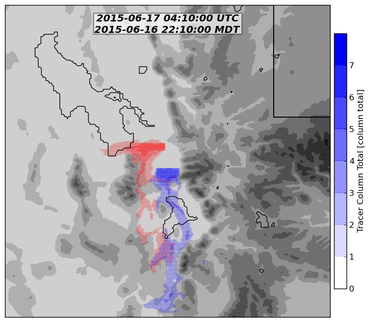
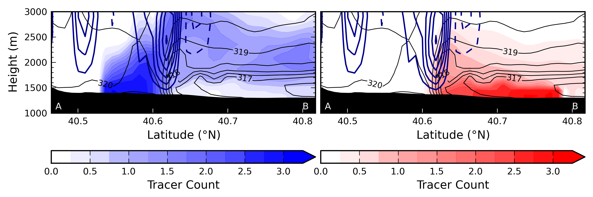

# WRF Tracers

### How to add tracers in your WRF simulation
Check out some documentation on how I did this here:
http://home.chpc.utah.edu/~u0553130/Brian_Blaylock/tracer.html

### Code for WRF Tracer Plots
My WRF tracers were premiered in the article *Impact of Lake Breezes on Summer Ozone Concentrations in the Salt Lake Valley*:
http://journals.ametsoc.org/doi/abs/10.1175/JAMC-D-16-0216.1

- `PLUMES_high_freq.py`  
This python script plots the tracers in a plane view. The vertical axis of the 3D variable is summed together to a flat surface and plotted on a map. It is "high frequency" becuase I outputed the plume variables at 15 minute intervals instead of the the hourly output that all my general WRF output was written.  
  

- `cross_section_hires_NplumeANDSplume.py`  
This python script plots the tracers along a cross section.  
  

*Note: The raw scripts don't create the exact images shown, it is just for showing an example of what you can make with a little tweeking*